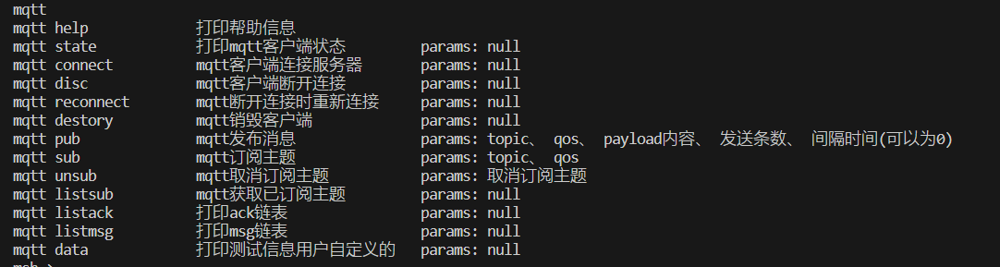

# RyanMqtt

📢 **使用过程中遇到问题？欢迎提交 Issue 或在 [RT-Thread 社区](https://club.rt-thread.org/index.html) 提问，感谢支持！**

- [RT-Thread-RyanMqtt使用介绍和示例代码（一）RT-Thread问答社区 - RT-Thread](https://club.rt-thread.org/ask/article/51a25ba90fc5e1b5.html)
- [RT-Thread-RyanMqtt QOS质量测试（二）RT-Thread问答社区 - RT-Thread](https://club.rt-thread.org/ask/article/e95c5b9390c53cf3.html)

- [RT-Thread-RyanMqtt 移植指南（三）RT-Thread问答社区 - RT-Thread](https://club.rt-thread.org/ask/article/611b7a947f7221cf.html)
- [keil使用 RyanMQTT 编译错误（中文编码问题）RT-Thread问答社区 - RT-Thread](https://club.rt-thread.org/ask/question/7269a82662b6cf31.html)

### 1、介绍

**RyanMqtt** 是一个严格遵循 [MQTT 3.1.1](https://docs.oasis-open.org/mqtt/mqtt/v3.1.1/mqtt-v3.1.1.html) 协议标准实现的客户端库，专为资源受限的嵌入式设备设计并优化。

初衷：在使用 [RT-Thread](https://github.com/RT-Thread/rt-thread) 开发过程中，缺乏一个功能完整且稳定可靠的 MQTT 客户端。而 MQTT 又是物联网项目中的核心通信协议。因此，基于标准协议规范与实际项目需求，设计并实现了 RyanMqtt。

#### 主要特性

- ✅ **严格遵循  [MQTT 3.1.1](https://docs.oasis-open.org/mqtt/mqtt/v3.1.1/mqtt-v3.1.1.html)  协议标准**，确保与各类服务器的高度兼容性

- ✅ **运行时安全分析验证**，使用 **[Sanitizer](https://clang.llvm.org/docs/index.html#sanitizers)** 系列工具，捕获内存越界、Use-after-free、数据竞争、未定义行为、内存泄漏等问题，提升代码健壮性与安全性

- ✅ **高质量代码保障** ， 引入 **[clang-tidy](https://clang.llvm.org/extra/clang-tidy/#clang-tidy)** 与 **[Cppcheck](https://cppcheck.sourceforge.io/)** 进行静态分析，实现接近语法级的"**零缺陷**"，显著提升可维护性与可读性

- ✅ **AI 辅助开发与审查**，结合  **[coderabbitai](https://www.coderabbit.ai)** 与 **[Copilot](https://github.com/features/copilot)** ，在编码与代码审查阶段持续优化代码质量，构建多层安全防线

- ✅ **11 大类专项测试用例**，覆盖广泛场景，全链路内存泄漏检测，强化稳定性与可靠性

- ✅ **支持多客户端实例**，满足复杂业务场景下的多连接需求

- ✅ **支持弱网/丢包严重环境**，保障连接稳定与消息可靠传输

- ✅ **全等级 QoS 支持（QoS0/1/2）**，并提供**用户可控的消息丢弃策略**，防止 QoS1/QoS2 重传导致内存无限堆积

- ✅ **完整的主题匹配与通配符支持**，主题层级分隔符 `/`、通配符 `#`/`+`，并正确处理以 `$` 开头的系统主题

- ✅ **批量订阅 / 取消订阅**，减少网络交互次数，提高效率

- ✅ **可配置连接参数**，支持 KeepAlive、自动重连、LWT（遗嘱消息）、Clean Session 等功能

- ✅ **丰富的参数与事件回调接口**，丰富的参数配置与事件回调接口，满足绝大多数实际项目需求（**欢迎提出新需求**）

- ✅**高性能与高并发能力**，在 Linux 环境下稳定支撑 20 个并发发送线程，每线程连续发送 1000 条 QoS1/QoS2 消息，零丢包、零异常
  
- ✅ **复杂线程环境下稳定运行**，已在公司多个商业项目中长期验证

- ✅ **跨平台设计**，仅需实现少量平台接口即可快速移植

- ✅ **低资源占用，依赖极少**，适合资源受限环境

- ❌ **无内置 TLS 支持**：需由用户在平台层自行实现（避免模块冲突，适配多业务共用 TLS 的场景）

- ❌ **不支持裸机平台**：建议裸机系统使用 coreMQTT 等更适合无操作系统环境的实现

### 2、设计

RyanMqtt 设计时参考了[mqttclient](https://github.com/jiejieTop/mqttclient)、[esp-mqtt](https://github.com/espressif/esp-mqtt)、[coreMQTT](https://github.com/FreeRTOS/coreMQTT)。

| 模块                 | 说明                                                         |
| -------------------- | ------------------------------------------------------------ |
| **平台兼容层**       | 封装不同操作系统内核接口，实现跨平台支持                     |
| **核心库**           | 基于 [coreMQTT](https://github.com/FreeRTOS/coreMQTT) 实现 MQTT 报文的序列化与解析 |
| **核心线程**         | 每个客户端独占一个线程，统一处理状态机、事件回调、心跳保活、消息解析、超时重传等逻辑 |
| **系统服务管理模块** | 提供会话管理、事件调度、通配符匹配、消息链表管理等基础服务   |
| **用户应用模块**     | 向用户提供完整的 API 接口，包括客户端生命周期管理、连接控制、发布/订阅、事件注册等 |

### 3、测试体系

**11 大类专项测试用例**，覆盖从基础功能到极限压力场景的全流程验证：

| 测试类别                                                  | 测试目标                                                     |
| --------------------------------------------------------- | ------------------------------------------------------------ |
| 1. 客户端销毁压力测试                                     | 验证资源释放的幂等性与完整性                                 |
| 2. 心跳与超时处理                                         | Keep-Alive、PINGREQ/RESP 机制验证                            |
| 3. 消息链路完整性（QoS 0/1/2）                            | QoS 0/1/2 消息端到端可靠性验证                               |
| 4. 自动/手动重连机制                                      | 状态机正确性与连接恢复能力                                   |
| 5. 批量/重复订阅一致性                                    | 订阅表一致性、内存安全、去重逻辑                             |
| 6. 多客户端高并发                                         | 20+ 客户端并发运行稳定性                                     |
| 7. 单客户端多线程共享（20 线程 × 各 1000 条 QoS1/2 消息） | 锁机制、数据一致性、竞态防护                                 |
| 8. 公共API参数校验                                        | 提升接口健壮性与可用性                                       |
| 9. 随机网络故障内存回收检测                               | 验证异常网络情况下的内存释放，提升接口健壮性与可用性         |
| 10. 随机网络故障弱网丢包测试                              | 在弱网及高丢包环境下，完成 QOS 全等级消息完整性与内存回收验证 |
| 11. 随机内存故障，内存回收测试                            | 验证内存异常情况下的资源释放，提升接口健壮性与可用性         |

#### 📊 测试覆盖范围

- **基础连接**：100 次循环连接/断开，混合 QoS 消息与订阅
- **消息流控**：连续发送 QoS0/1/2 等级 1000 条消息，混合 QoS 压力测试
- **订阅管理**：批量、大量、重复、混合 QoS 订阅与取消
- **并发压测:**
  - 单客户端 20 线程 × 各 1000 条 QoS1/2 消息
  - 多客户端 20 并发实例进行双向发布/订阅
- **可靠性**：长连接、弱网、随机网络故障、随机内存故障、Keep-Alive、重连机制验证
- **资源安全**：全链路内存泄漏、句柄泄漏检测

### 4、代码质量与规范

#### ✅ 工具链全面集成

| 工具                                                         | 用途                                                         |
| ------------------------------------------------------------ | ------------------------------------------------------------ |
| **[Sanitizer](https://clang.llvm.org/docs/index.html#sanitizers)** | 运行时捕获内存与线程安全问题                                 |
| **[clang-tidy](https://clang.llvm.org/extra/clang-tidy/#clang-tidy)** | 静态分析潜在缺陷（空指针、资源泄漏等）                       |
| **[Cppcheck](https://cppcheck.sourceforge.io/)**             | 深度扫描内存与资源问题                                       |
| **[ClangFormat](https://clang.llvm.org/docs/ClangFormat.html)** | 统一代码风格                                                 |
| **编译器警告**                                               | `-Wall -Wextra`（默认）、`-Weffc++`/`-Weverything`（Clang 可选，CI 强化时开启） |

#### ✅ 检查重点覆盖

- 内存安全：杜绝泄漏、越界、悬空指针
- 性能优化：减少冗余拷贝与低效算法
- 可读性：命名规范、注释完整、逻辑清晰

> ✅ **成果**：实现接近语法级"**零缺陷**"，长期维护成本大幅降低

### 5、平台接口

_RyanMqtt 依赖于用户实现以下三类平台接口，以确保在不同系统中正常运行。_

#### System 接口（RTOS 必需）

_RyanMqtt 需要 RTOS 支持，必须实现如下接口才可以保证 mqtt 客户端的正常运行_

| 函数名称                | 函数简介     |
| ----------------------- | ------------ |
| platformMemoryMalloc    | 动态内存分配 |
| platformMemoryFree      | 释放内存     |
| platformDelay           | 毫秒延时     |
| platformPrint           | 打印字符串   |
| platformThreadInit      | 初始化线程   |
| platformThreadDestroy   | 销毁线程     |
| platformThreadStart     | 开启线程     |
| platformThreadStop      | 挂起线程     |
| platformMutexInit       | 初始化互斥锁 |
| platformMutexDestroy    | 销毁互斥锁   |
| platformMutexLock       | 获取互斥锁   |
| platformMutexUnLock     | 释放互斥锁   |
| platformCriticalInit    | 初始化临界区 |
| platformCriticalDestroy | 销毁临界区   |
| platformCriticalEnter   | 进入临界区   |
| platformCriticalExit    | 退出临界区   |

### Network 接口（网络通信必需）

_RyanMqtt 依赖于底层传输接口 API，必须实现该接口 API 才能在网络上发送和接收数据包_

_MQTT 协议要求基础传输层能够提供有序的、可靠的、双向传输（从客户端到服务端 和从服务端到客户端）的字节流_

| 函数名称                 | 函数简介                 |
| ------------------------ | ------------------------ |
| platformNetworkInit      | 网络资源初始化           |
| platformNetworkDestroy   | 网络资源销毁             |
| platformNetworkConnect   | 根据主机名/IP 与端口连接服务器 |
| platformNetworkRecvAsync | 非阻塞接收数据           |
| platformNetworkSendAsync | 非阻塞发送数据           |
| platformNetworkClose     | 断开 mqtt 服务器连接     |

> 🔐 如需 TLS 加密，请在 `platformNetworkConnect` 等接口中集成 TLS 层（如 mbedTLS、wolfSSL 等）

### Time 接口

_RyanMqtt 依靠函数生成毫秒时间戳，用于计算持续时间和超时，内部已经做了数值溢出处理_

| 函数名称         | 函数简介                     |
| ---------------- | ---------------------------- |
| platformUptimeMs | 返回系统启动以来的毫秒时间戳 |

### 6、示例

#### RT-Thread 平台

- 平台接口实现参考：`platform/rtthread/`

- 使用示例参考：`example/`
- 需启用 **SAL（Socket Abstraction Layer）组件**，示例基于 Socket 接口收发数据
- 需启用 **MSH（命令行组件）**，示例默认集成至 MSH

> 📌 **强烈建议参考 `example` 目录中的测试接口与使用范例，获取完整使用指导**

#### 合宙openLuat平台

- 接口示例请参考 platform/openLuat 文件夹，请根据平台差异进行修改

#### 移远QuecOpen平台

- 接口示例请参考 platform/quecopen 文件夹，请根据平台差异进行修改

#### 中移OpenCPU平台

- 接口示例请参考 platform/openCPU文件夹，请根据平台差异进行修改

#### Linux平台

- 接口示例请参考 platform/linux 文件夹，请根据平台差异进行修改

### 7、依赖

本项目 **无外部第三方库依赖**，仅依赖用户实现的平台接口。

### 8、免责声明

> ⚠️ **重要提示**

请**勿将本库用于支付、金融交易或其他可能造成重大损失的场景**。
 尽管 RyanMqtt 的 QoS2 消息机制经过大量测试验证，但在实际应用中，由于以下因素可能导致消息不可靠：

- 网络波动剧烈甚至无法建立稳定连接
- MQTT 服务端配置策略（如超时、限流、会话清理）
- 客户端或服务端资源不足

因此，**不能仅依赖 QoS2 保证数据安全与一致性**。
 **强烈建议在应用层实现数据校验、幂等处理与最终一致性机制**。

> 🛑 **作者不对因使用本库导致的任何直接或间接损失承担责任。请在深度评估后谨慎使用。**

如需进一步帮助，请访问 [RT-Thread 社区](https://club.rt-thread.org/index.html) 或联系作者。
